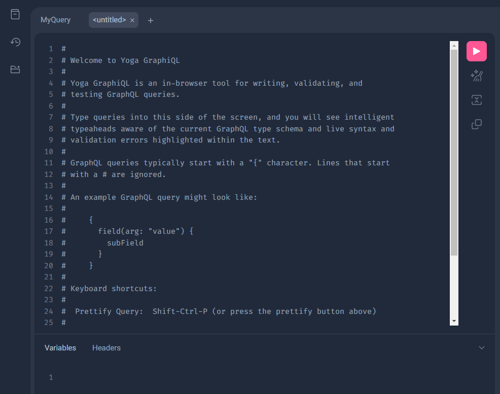

# estat api to graphql
e-Stat API を graphqlにしてみる

# overview
- e-Stat API を graphql化してみる
- 実装はOpenAPIのスキーマ定義を基にgraphqlの定義を生成できるgraphql-meshを利用  
https://the-guild.dev/graphql/mesh
- e-Stat API の OpenAPIのスキーマ定義はVer 3.0を使用


# QuickStart
1. コンテナのビルド
graphql-mesh用にnode.jsのコンテナをビルド
```
docker-compose build
```

2. コンテナの作成
作成したコンテナイメージを基にコンテナを作成
```
docker-compose up -d
```

3. コンテナの中に入ってgraphql-meshのサーバを起動
```
docker exec -it graphql-mesh /bin/sh
$ yarn mesh dev
yarn run v1.22.19
warning package.json: No license field
$ /app/node_modules/.bin/mesh dev
💡 🕸️  Mesh - Server Starting GraphQL Mesh...
💡 🕸️  Mesh - eStatAPI Generating GraphQL schema from OpenAPI schema
💡 🕸️  Mesh - eStatAPI Processing annotations for the execution layer
💡 🕸️  Mesh Generating index file in TypeScript
💡 🕸️  Mesh - Server Serving GraphQL Mesh: http://0.0.0.0:4000
💡 🕸️  Mesh Writing index.ts for ESM to the disk.
💡 🕸️  Mesh Writing index.ts for CJS to the disk.
```

4. 起動したサーバへアクセス（上記だとhttp://localhost:4000）


